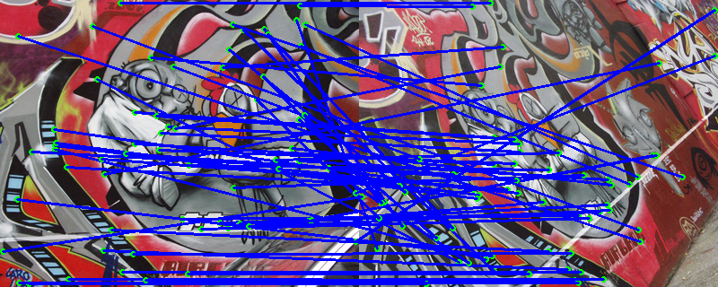

EN.601.661 – Computer Vision - Homework 2
-----------------------------------------
### To View This
This is a readme written in markdown. You can access [here](https://github.com/joe-siyuan-qiao/ComputerVision-HW2) to view it online.

### How to Run
```bash
# The results will be found in ./results/
python hw2.py
```
We also provide the pre-computed outputs in the directory _./results_

### Development Environment
| Package       | Version       |
| ------------- |:-------------:|
| Python        | 2.7.10        |
| NumPy         | 1.13.3        |
| OpenCV        | 3.3.0         |
| matplotlib    | 1.5.3         |
| SymPy         | 1.1.1         |

### The Corner Detection Results
The corner detection result of bikes1  


The corner detection result of bikes2  


The corner detection result of bikes3  


The corner detection result of graf1  


The corner detection result of graf2  


The corner detection result of graf3  


The corner detection result of leuven1  


The corner detection result of leuven2  


The corner detection result of leuven3  


The corner detection result of wall1  


The corner detection result of wall2  


The corner detection result of wall3  


### The Matching Results using the Sum-of-Squared-Distance
bikes1 and bikes2  

The matchings between the two images look very good.

bikes1 and bikes3  

The matchings between the two images look very good.

graf1 and graf2  

The matchings between the two images look very good.

graf1 and graf3  

The matchings between the two images are not very ideal.
This is probably due to the big rotation which change the appearance.

leuven1 and leuven2  

The matchings between the two images are not very ideal.
This is probably due to the big lighting difference between the two images.

leuven1 and leuven3  

The matchings between the two images are not very ideal.
This is probably due to the big lighting difference between the two images.

wall1 and wall2  

The matchings between the two images are not very ideal.
This is probably due to the fact that the walls have repeating patterns and everywhere looks similar.

wall1 and wall3  

The matchings between the two images are not very ideal.
This is probably due to the fact that the walls have repeating patterns and everywhere looks similar.

### The Matching Results using the Simple-SIFT
bikes1 and bikes2  

The matchings between the two images look very good.

bikes1 and bikes3  

The matchings between the two images look very good.

graf1 and graf2  

The matchings between the two images look very good.

graf1 and graf3  

The matchings between the two images are not very ideal.
This is probably due to the big rotation which change the appearance.

leuven1 and leuven2  

The matchings between the two images look very good.

leuven1 and leuven3  

The matchings between the two images look very good.

wall1 and wall2  

The matchings between the two images are sparse but accurate.

wall1 and wall3  

The matchings between the two images are not very ideal.
This is probably due to the big rotation that changes the distributions of the gradients.

### RANSAC and Stitching using Affine and SSD
bikes1 and bikes2  


bikes1 and bikes3  


graf1 and graf2  


graf1 and graf3  


leuven1 and leuven2  


leuven1 and leuven3  


wall1 and wall2  


wall1 and wall3  


### RANSAC and Stitching using Perspective and SSD
bikes1 and bikes2  


bikes1 and bikes3  


graf1 and graf2  


graf1 and graf3  


leuven1 and leuven2  


leuven1 and leuven3  


wall1 and wall2  


wall1 and wall3  


### RANSAC and Stitching using Affine and SSIFT
bikes1 and bikes2  


Using SSIFT produces similar but a little bit worse result.
This is probably due to that the second image is blurred thus has less clear gradients.

bikes1 and bikes3  


Using SSIFT produces similar but a little bit worse result.
This is probably due to that the third image is blurred thus has less clear gradients.

graf1 and graf2  


Using SSIFT produces similar result.

graf1 and graf3  


Using SSIFT cannot produce good result, either.

leuven1 and leuven2  


Using SSIFT produces result that is much better than using SSD.
This is because the lighting changes do not change the distribution of gradients too much.

leuven1 and leuven3  


Using SSIFT produces result that is much better than using SSD.
This is because the lighting changes do not change the distribution of gradients too much.

wall1 and wall2  


Using SSIFT produces result that is much better than using SSD.
But I think this is due to the mechanism we use to determine the matchings between two points.

wall1 and wall3  


Using SSIFT cannot produce good result, either.

### RANSAC and Stitching using Perspective and SSIFT
bikes1 and bikes2  


bikes1 and bikes3  


graf1 and graf2  


graf1 and graf3  


leuven1 and leuven2  


leuven1 and leuven3  


wall1 and wall2  


wall1 and wall3  


